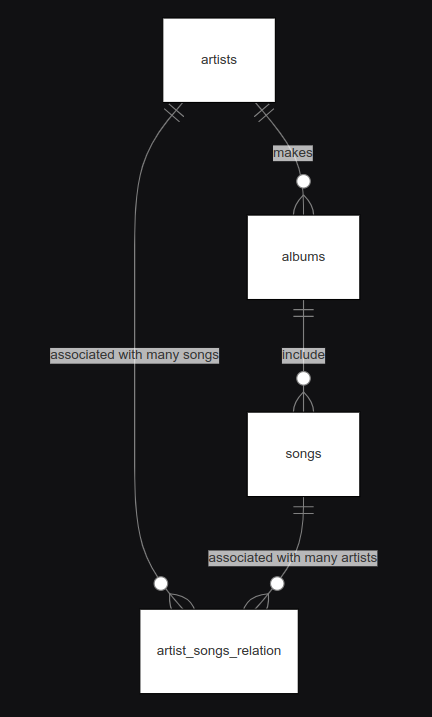
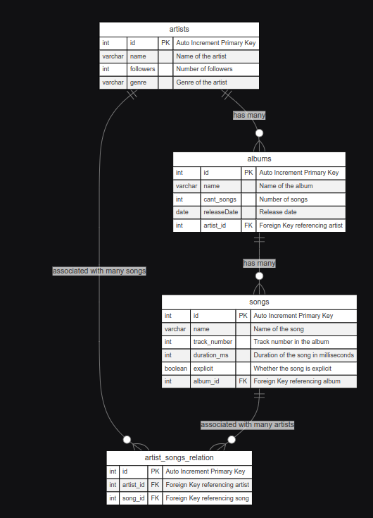

# Design Document

By Mauro Andres Ronconi
* GitHub: **Laharke**
* edX username:  **Laharke**
* City, Country: Bahia blanca, Argentina
* Date video: 26/09/2024

## Scope

The purpose of this database is to emulate a lite version of spotify's own database.
Although it's a lite version, it covers essential information for projects that need information regarding artists/bands and their albums and/or songs.
It's prepared to be populated with a script that takes user input to get all related info of the wanted band/artist to be used however they want.
Included in the database's scope is:

* Artists, including basic information as genres and follower quantity.
* Albums, including information about the album such as name, release date, song quantity and creator(s).
* Songs, including information about the song such as name, duration, if it's explicit or not, to which album it belongs, and the track number in said album.

Out of scope are elements like popularity, related artists, rating of albums, playlist related information, and some other irrelevant info for small projects that the Spotify API provides.

## Functional Requirements

This database is prepared to be used alongside a script to populate it with the desired artists/bands information and then use said information on a website or for data analysis.
Although you could perform all CRUD operations on it, it's recommended/optimized just to query the data once it has been populated by the script.
More importantly, even though it does support collaborations on songs, that IS represented. Collaboration on albums is not contemplated in this iteration of the Database.

## Representation

Entities are captured in MySQL tables with the following schema:

### Entities
The database includes the following entities:

## Artists
* `id`, which specifies the unique ID for the artist as an `INT`. This column thus has the `PRIMARY KEY` constraint applied alongside an `AUTO_INCREMENT`.
* `name`, which specifies the artist/band name as `VARCHAR`, it has a limit of 255 characters, as it's the limit and more than enough for a name. It has a `NOT NULL` constraint, as it's information we need.
* `followers`, which represents the artist/band's total followers on Spotify. `INT` is applied on this column since a number is expected on it and it's big enough to cover said number.
* `genre`, representing a list of the genres the artist/band can be assigned to, it has a `VARCHAR` with the max limit on it (255) since many genres can be applied to one artist. It was considered using a `ENUM` but that would have been more difficult for the inserting process and it's simpler to just have a list with the genres.

## Albums
* `id`, which specifies the unique ID for the album as an `INT`. This column thus has the `PRIMARY KEY` constraint applied alongside an `AUTO_INCREMENT`.
* `name`, which specifies the album name as `VARCHAR`, it has a limit of 255 characters as its the limit and more than enough for a name. It has a `NOT NULL` constraint as it's information we need.
* `cant_songs`, which represents the album's total songs. `INT` is applied on this column since a number is expected on it and it's big enough to cover said number.
* `relaseDate`, which represents the album's release date. A `DATE` is applied on this column since it fits perfectly the release date info that Spotify has in it's API for albums.
* `artist_id`, represents the id of the artist that wrote the album, it's an `INT` because its a `FOREIGN KEY` that references the `artists` table(in the `id` column). It could've been a many-to-many relationship on a complementary table but collaborative albums where not contemplated on this database.

## Songs
* `id`, which specifies the unique ID for the song as an `INT`. This column thus has the `PRIMARY KEY` constraint applied alongside an `AUTO_INCREMENT`.
* `name`, which specifies the song name as `VARCHAR`, it has a limit of 255 characters as its the limit and more than enough for a name. It has a `NOT NULL` constraint as it's information we need.
* `track_number`, which indicates which order the song occupies on it's respective album. `INT` is applied on this column since a number is expected on it and it's big enough to cover said number.
* `duration_ms`, which represents the song's total durations expressed in milliseconds. `INT` is applied on this column since a number is expected on it and it's big enough to cover said number.
* `explicit`, which represents if it's a explicit song or not. `BOOLEAN` is applied on this column since it's a true or false value which is the intended use of booleans.
* `album_id`, represents the id of the album the song belongs to, it's an `INT` because it is a `FOREIGN KEY` that references the `albums` table (in the `id` column). It could've been a many to many relationship on a complementary table but songs being repeated on other albums was not contemplated on this database.

## artist_songs_relation
* `id`, which specifies the unique ID for the relation as an `INT`. This column thus has the `PRIMARY KEY` constraint applied alongside an `AUTO_INCREMENT`.
* `artist_id`, represents the id of the artist that wrote the song, it's an `INT` because its a `FOREIGN KEY` that references the `artists` table(in the `id` column).
* `song_id`, represents the id of the song that written by the artist, it's an `INT` because its a `FOREIGN KEY` that references the `songs` table(in the `id` column).
Both `artist_id` and `song_id` have a `NOT NULL` constraint since both are required to make a relation between song and artist.

It's designed this way so that a song can have multiple artists. This way we covers songs by an artist that feature another artist/s.

### Relationships

The below entity relationship diagram describes the relationships among the entities in the database.

Another (more complex) version of the diagram were you can see each table field and how they work together can be found here:

As detailed by both diagrams:

* One artist can have as many albums as needed. An album is assumed to be made by one artist/band.
* Albums can include as many song as needed. It's assumed that a song is included in one album and one album only.
* Songs are included in albums but we also have a many to many relationship with the table artists, taking this approach we can associate a song to more than one artist so that song with 'feats' are possible to include.

## Optimizations

I created indexes on all the name columns since we will be frequently searching by name and this allows for a fast lookup on the artists, albums and songs tables.
Additionally, a view was also created joining the three main tables and selecting the relevant info about an artist to simplify querying for all the info related to an artist.

## Limitations

The limitations of the database are related mostly to the many-to-many relationship not used regarding Artists and Albums. For a practical sake, Collaborative albums were not taken into account when designing the database, nor were songs that repeat on more than one album. Both of these changes would require adding two more tables to create a many-to-many relationship between the id's of the tables which will be an overkill for the scope of the project and my emphasis on simplicity and simple queries.
